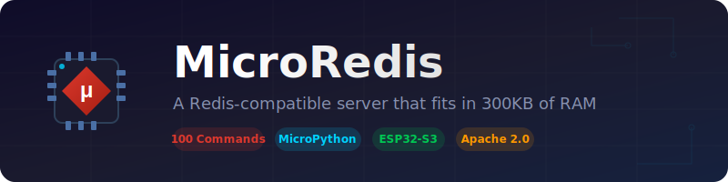
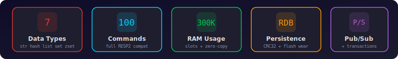

<p align="center">
  
</p>

<p align="center">
  <strong>A Redis-compatible server that fits in 300KB of RAM</strong>
</p>

<p align="center">
  <a href="#quick-start">Quick Start</a> &bull;
  <a href="#commands">Commands</a> &bull;
  <a href="#architecture">Architecture</a> &bull;
  <a href="#configuration">Configuration</a> &bull;
  <a href="CONTRIBUTING.md">Contributing</a>
</p>

<p align="center">
  
  
  
  
  
</p>

---

## Why MicroRedis?

MicroRedis is the only full-featured Redis server that runs on a microcontroller. It's not a demo or a toy -- it's a working implementation with **100 registered commands**, compatible with `redis-cli` and standard Redis client libraries.

- **100 commands** across 7 data types + Streams + HyperLogLog
- **Wire-compatible** with redis-cli, redis-py, ioredis, and any RESP2 client
- **Zero external dependencies** -- pure MicroPython / CPython
- **Memory-optimized** -- `__slots__` everywhere, zero-copy parsing, lazy expiry, reservoir sampling LRU

<p align="center">
  
</p>

## Features

| Category | What you get |
|----------|-------------|
| **Data Types** | String, Hash, List, Set, Sorted Set, Stream, HyperLogLog |
| **Bitmap Ops** | SETBIT, GETBIT, BITCOUNT, BITOP, BITFIELD, BITPOS |
| **Pub/Sub** | SUBSCRIBE, UNSUBSCRIBE, PUBLISH with glob pattern matching |
| **Transactions** | WATCH / MULTI / EXEC / DISCARD with optimistic locking |
| **TTL** | Lazy expiry on access + active expiry background task |
| **Persistence** | MicroRDB binary format with CRC32 checksums, flash wear-leveling |
| **Memory Mgmt** | Configurable LRU / random eviction, MAX_KEYS enforcement |
| **Security** | AUTH password middleware, per-client rate limiting |
| **Networking** | Async TCP, up to 8 concurrent clients |

## Quick Start

### CPython (development / testing)

```python
from microredis.main import run
run()
```

```bash
redis-cli -h 127.0.0.1 -p 6379
127.0.0.1:6379> PING
PONG
127.0.0.1:6379> SET sensor:temp 23.5 EX 60
OK
127.0.0.1:6379> HSET device:001 name "ESP32" location "office"
(integer) 2
127.0.0.1:6379> ZADD leaderboard 100 alice 200 bob
(integer) 2
```

### ESP32-S3 with MicroPython

```python
from microredis.main import connect_wifi, run

ip = connect_wifi('YourSSID', 'YourPassword')
print(f'MicroRedis at {ip}:6379')
run()
```

## Installation

### ESP32-S3

```bash
# Flash MicroPython firmware
esptool.py --chip esp32s3 erase_flash
esptool.py --chip esp32s3 write_flash -z 0x0 esp32s3-micropython.bin

# Upload MicroRedis
mpremote cp -r microredis :
```

### Development (CPython)

```bash
git clone https://github.com/mateuszsury/microredis.git
cd microredis

# Run unit tests
python microredis/tests/runner.py

# Start server
python -c "from microredis.main import run; run()"
```

## Commands

100 commands organized by category:

### Connection & Server (8)

| Command | Description |
|---------|-------------|
| `PING [message]` | Test connection, returns PONG |
| `ECHO message` | Echo the message back |
| `QUIT` | Close connection |
| `COMMAND` | Get command metadata |
| `INFO [section]` | Server information |
| `DBSIZE` | Number of keys in database |
| `FLUSHDB [ASYNC\|SYNC]` | Remove all keys |
| `TIME` | Current server time |

### String (23)

| Command | Description |
|---------|-------------|
| `GET key` | Get value |
| `SET key value [EX s] [PX ms] [NX\|XX]` | Set with options |
| `SETNX key value` | Set only if not exists |
| `SETEX key seconds value` | Set with TTL (seconds) |
| `PSETEX key ms value` | Set with TTL (milliseconds) |
| `GETSET key value` | Set and return old value |
| `GETDEL key` | Get and delete |
| `GETEX key [EX\|PX\|EXAT\|PXAT\|PERSIST]` | Get with expiry options |
| `APPEND key value` | Append to string |
| `STRLEN key` | Get string length |
| `INCR key` | Increment by 1 |
| `DECR key` | Decrement by 1 |
| `INCRBY key n` | Increment by n |
| `DECRBY key n` | Decrement by n |
| `INCRBYFLOAT key n` | Float increment |
| `GETRANGE key start end` | Substring |
| `SETRANGE key offset value` | Overwrite at offset |
| `SETBIT key offset value` | Set bit |
| `GETBIT key offset` | Get bit |
| `BITCOUNT key [start end]` | Count set bits |
| `MGET key [key ...]` | Get multiple |
| `MSET key value [key value ...]` | Set multiple |
| `MSETNX key value [key value ...]` | Set multiple if none exist |

### Key Management (13)

| Command | Description |
|---------|-------------|
| `DEL key [key ...]` | Delete keys |
| `EXISTS key [key ...]` | Check existence |
| `TYPE key` | Get key type |
| `KEYS pattern` | Find keys by glob pattern |
| `RENAME key newkey` | Rename key |
| `RENAMENX key newkey` | Rename only if newkey absent |
| `TTL key` | TTL in seconds |
| `PTTL key` | TTL in milliseconds |
| `EXPIRE key seconds` | Set TTL (seconds) |
| `EXPIREAT key timestamp` | Set TTL (Unix timestamp) |
| `PEXPIRE key ms` | Set TTL (milliseconds) |
| `PEXPIREAT key ms-timestamp` | Set TTL (Unix ms timestamp) |
| `PERSIST key` | Remove expiry |

### Hash (11)

| Command | Description |
|---------|-------------|
| `HSET key field value [f v ...]` | Set fields |
| `HGET key field` | Get field value |
| `HDEL key field [field ...]` | Delete fields |
| `HEXISTS key field` | Check field existence |
| `HGETALL key` | Get all fields and values |
| `HKEYS key` | Get all field names |
| `HVALS key` | Get all values |
| `HLEN key` | Number of fields |
| `HMGET key field [field ...]` | Get multiple fields |
| `HINCRBY key field n` | Increment field (int) |
| `HINCRBYFLOAT key field n` | Increment field (float) |

### List (9)

| Command | Description |
|---------|-------------|
| `LPUSH key element [element ...]` | Push to head |
| `RPUSH key element [element ...]` | Push to tail |
| `LPOP key [count]` | Pop from head |
| `RPOP key [count]` | Pop from tail |
| `LLEN key` | List length |
| `LRANGE key start stop` | Get range |
| `LINDEX key index` | Get by index |
| `LSET key index value` | Set by index |
| `LTRIM key start stop` | Trim to range |

### Set (14)

| Command | Description |
|---------|-------------|
| `SADD key member [member ...]` | Add members |
| `SREM key member [member ...]` | Remove members |
| `SISMEMBER key member` | Check membership |
| `SMEMBERS key` | Get all members |
| `SCARD key` | Set cardinality |
| `SINTER key [key ...]` | Intersection |
| `SUNION key [key ...]` | Union |
| `SDIFF key [key ...]` | Difference |
| `SINTERSTORE dest key [key ...]` | Store intersection |
| `SUNIONSTORE dest key [key ...]` | Store union |
| `SDIFFSTORE dest key [key ...]` | Store difference |
| `SPOP key [count]` | Remove random members |
| `SRANDMEMBER key [count]` | Get random members |
| `SMOVE src dest member` | Move member between sets |

### Sorted Set (12)

| Command | Description |
|---------|-------------|
| `ZADD key score member [score member ...]` | Add with scores |
| `ZREM key member [member ...]` | Remove members |
| `ZSCORE key member` | Get member score |
| `ZRANK key member` | Rank (ascending) |
| `ZREVRANK key member` | Rank (descending) |
| `ZCARD key` | Cardinality |
| `ZRANGE key start stop [WITHSCORES]` | Range by rank |
| `ZREVRANGE key start stop [WITHSCORES]` | Reverse range by rank |
| `ZINCRBY key increment member` | Increment score |
| `ZCOUNT key min max` | Count in score range |
| `ZRANGEBYSCORE key min max [WITHSCORES] [LIMIT]` | Range by score |
| `ZREVRANGEBYSCORE key max min [WITHSCORES] [LIMIT]` | Reverse range by score |

### HyperLogLog (3)

| Command | Description |
|---------|-------------|
| `PFADD key element [element ...]` | Add elements |
| `PFCOUNT key [key ...]` | Estimate cardinality |
| `PFMERGE dest src [src ...]` | Merge HLLs |

### Bitmap (3)

| Command | Description |
|---------|-------------|
| `BITPOS key bit [start [end [BYTE\|BIT]]]` | Find first bit |
| `BITOP op dest key [key ...]` | Bitwise AND/OR/XOR/NOT |
| `BITFIELD key [GET\|SET\|INCRBY ...]` | Arbitrary bit operations |

### Stream (6)

| Command | Description |
|---------|-------------|
| `XADD key ID field value [...]` | Append entry |
| `XLEN key` | Stream length |
| `XRANGE key start end [COUNT n]` | Range query |
| `XREVRANGE key end start [COUNT n]` | Reverse range query |
| `XREAD [COUNT n] STREAMS key [key ...] ID [ID ...]` | Read from streams |
| `XTRIM key MAXLEN [~] count` | Trim to max length |

## Architecture

<p align="center">
  
</p>

```
microredis/
├── core/                    # Protocol layer
│   ├── protocol.py          # RESP2 streaming parser (state machine, zero-copy)
│   ├── response.py          # RESP2 response builder with pre-allocated constants
│   └── constants.py         # Platform-tuned limits
├── network/                 # Network layer
│   ├── connection.py        # Async TCP handler (uasyncio)
│   ├── router.py            # Command dispatch (100 commands, O(1) lookup)
│   ├── middleware.py         # Auth + rate limiting pipeline
│   └── pool.py              # Connection pool management
├── storage/                 # Storage engine
│   ├── engine.py            # Dict-backed store with TTL, types, versioning
│   ├── expiry.py            # Min-heap active expiry manager
│   ├── memory.py            # LRU / random eviction, OOM handling
│   └── datatypes/           # Type-specific operations
│       ├── string.py        # String + numeric + bit operations
│       ├── hash.py          # Hash with ziplist optimization
│       ├── list.py          # List (plain list, not deque)
│       ├── set.py           # Set with intset optimization
│       └── zset.py          # Sorted set (dict + sorted list)
├── commands/                # Advanced command modules
│   ├── bitmaps.py           # BITPOS, BITOP, BITFIELD
│   ├── hyperloglog.py       # HLL with 12KB registers
│   └── streams.py           # Append-only log with ID generation
├── features/                # Feature modules
│   ├── pubsub.py            # Pub/Sub with glob pattern matching
│   └── transaction.py       # WATCH/MULTI/EXEC optimistic locking
├── persistence/             # Persistence layer
│   ├── snapshot.py          # MicroRDB binary format (CRC32 checksums)
│   └── flash.py             # Flash wear-leveling for ESP32
├── tests/                   # Built-in test suite
│   └── runner.py            # 74 tests, runs on MicroPython + CPython
├── config.py                # Runtime configuration
├── exceptions.py            # Redis-compatible error types
├── utils.py                 # Shared utilities (glob_match, etc.)
└── main.py                  # Server entry point
```

## Memory Footprint

| Component | Size |
|-----------|------|
| Server overhead | ~40KB |
| Per connection | ~500B |
| Per HyperLogLog key | ~12KB |
| Per hash (ziplist, <64 fields) | ~40% less than dict |
| Per set (intset, <512 ints) | ~60% less than set |
| Per key (string, typical) | ~100-200B |

### Key Optimizations

- **`__slots__`** on every class -- eliminates per-instance `__dict__`
- **Zero-copy parsing** -- `memoryview` over `bytearray`, no intermediate copies
- **Lazy expiry** -- TTL checked only on key access, no background scanning of all keys
- **Active expiry** -- probabilistic sampling deletes expired keys in background
- **Reservoir sampling LRU** -- approximate LRU without copying key lists
- **Pre-allocated RESP constants** -- `+OK\r\n`, `$-1\r\n`, etc. allocated once

## Configuration

Edit `microredis/config.py` or pass options programmatically:

```python
from microredis.main import MicroRedisServer

server = MicroRedisServer('0.0.0.0', 6379)
```

| Setting | Default | Description |
|---------|---------|-------------|
| `port` | 6379 | TCP port |
| `maxclients` | 8 | Max concurrent connections |
| `timeout` | 300 | Client idle timeout (seconds) |
| `maxmemory` | 0 | Memory limit (0 = unlimited) |
| `maxmemory_policy` | `allkeys-lru` | Eviction policy |
| `maxmemory_samples` | 5 | LRU sampling count |
| `requirepass` | None | AUTH password |
| `dbfilename` | `microredis.mrdb` | Snapshot filename |
| `hz` | 10 | Server tick rate |

## Testing

```bash
# Unit tests (74 tests, no server needed)
python microredis/tests/runner.py

# Integration tests (start server first)
python -c "from microredis.main import run; run()" &
python tests/test_simple.py
python tests/test_integration.py
python tests/test_transaction.py
```

## Comparison with Redis

| Feature | Redis | MicroRedis |
|---------|-------|------------|
| String, Hash, List, Set, Sorted Set | Yes | Yes |
| Streams | Yes | Yes (basic) |
| HyperLogLog | Yes | Yes |
| Pub/Sub | Yes | Yes (no PSUBSCRIBE yet) |
| Transactions (MULTI/EXEC/WATCH) | Yes | Yes |
| TTL / Expiry | Yes | Yes (lazy + active) |
| Persistence | RDB + AOF | MicroRDB (binary snapshots) |
| Lua scripting | Yes | No |
| Cluster | Yes | No |
| ACL | Yes | Simple AUTH only |
| Replication | Yes | No |
| Blocking commands (BLPOP) | Yes | No |
| Memory target | Gigabytes | 300KB RAM |

## Contributing

See [CONTRIBUTING.md](CONTRIBUTING.md) for development setup, code style, and PR process.

## License

[Apache License 2.0](LICENSE) -- Copyright 2025-2026 Mateusz Sury

## Credits

Developed for ESP32-S3 MicroPython environments.
Inspired by [Redis](https://redis.io/) by Salvatore Sanfilippo.

---

<p align="center">
  <sub>Built for microcontrollers. Compatible with the Redis ecosystem.</sub>
</p>
